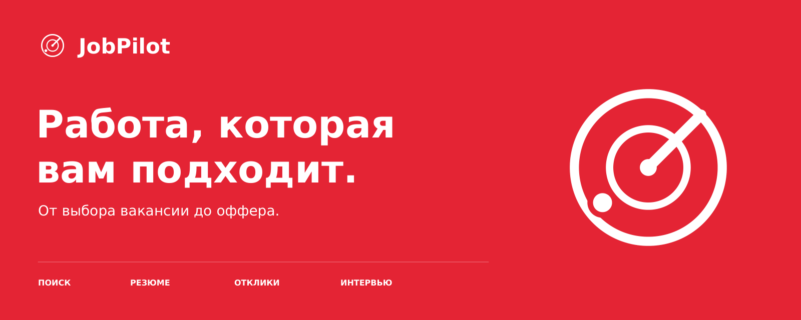

  

**JobPilot — персональный сервис поиска работы в России.** Помогает находить подходящие вакансии, понимать требования, готовить резюме и сопроводительные письма, вести отклики до интервью и оффера.

[Как работает](#как-работает) · [MVP](#mvp) · [Планы](#планы-развития) · [Брендбук](brand/JobPilot_Brandbook.pdf)

> **Стадия проекта:** рабочий веб-прототип. Реализованы лендинг, онбординг, личный кабинет, ручное добавление вакансий, сопоставление навыков, черновики документов и трекер. Автопоиск, языковая модель и интеграции с площадками пока не подключены.

## Проблема

Поиск работы быстро превращается в отдельную работу. Кандидат переключается между площадками, сравнивает похожие вакансии, редактирует резюме и заново пишет письма. История откликов остаётся в переписках и таблицах, а договорённости и следующие шаги легко потерять.

Количество отправленных резюме не помогает понять главное: где опыт действительно подходит, что стоит уточнить и на какие возможности потратить время.

## Решение

JobPilot собирает поиск в одном рабочем пространстве. В основе — профиль кандидата, его реальные навыки и условия, на которых он готов менять работу. Для каждой вакансии сервис помогает принять решение, подготовить документы и сохранить историю дальнейшего общения.

Первый фокус — специалисты, самостоятельно ищущие следующую работу на российском рынке. Интерфейс и документы — на русском; в предпочтениях учитываются город, удалённая работа, гибрид или офис, зарплата в рублях с указанием «на руки» либо «до вычета».

## Как работает

1. **Профиль и цель.** Кандидат добавляет резюме, опыт и навыки, выбирает должность, доход, город, формат работы и ограничения.
2. **Подбор вакансий.** Сервис помогает собрать подходящие позиции. В первой версии — добавление ссылки и текста вакансии; подключение источников запланировано отдельно.
3. **Разбор соответствия.** По каждому требованию видно, что подтверждается профилем, чего не хватает и что нужно уточнить. Отсутствие сведений не считается отсутствием навыка.
4. **Подготовка отклика.** JobPilot предлагает версию резюме и сопроводительное письмо под конкретную позицию. Кандидат видит изменения и утверждает текст.
5. **Отклик и история.** После отправки кандидат фиксирует отклик, ответ работодателя и следующий шаг. Все документы остаются связаны с вакансией.
6. **Интервью и предложение.** В карточке сохраняются даты встреч, заметки и условия оффера, чтобы сравнивать возможности на одной основе.

## Основные функции

| Функция | Что получает кандидат |
| --- | --- |
| Профиль поиска | Единые требования к роли, зарплате, месту и формату работы |
| Подбор и фильтрация | Список вакансий, которые имеет смысл изучить |
| Объяснимое соответствие | Разбор требований с опорой на факты из резюме |
| Адаптация резюме | Акценты и формулировки под позицию без выдуманного опыта |
| Сопроводительное письмо | Черновик с конкретной связью между опытом и задачами работодателя |
| Учёт откликов | Статусы, документы, заметки и следующее действие в одном месте |
| Подготовка к интервью | В плане развития: вопросы и темы на основе вакансии и профиля |

Путь отклика: **Сохранено → Готовится → Отправлено → Интервью → Оффер**. Отказ работодателя, отзыв кандидатом и архив сохраняются отдельно с историей переходов.

## Принципы продукта

- **Факты сохраняются.** Не добавляем работодателей, навыки, стаж, достижения или цифры, которых кандидат не подтверждал. Предложения дополнить профиль явно отделены от готового текста.
- **Кандидат управляет отправкой.** В MVP отправка происходит вручную. Возможные будущие интеграции должны сохранять предварительный просмотр и подтверждение.
- **Оценка объяснима.** Соответствие требованиям не выдаётся за вероятность приглашения или оффера. Неизвестные данные обозначаются прямо.
- **Данные подконтрольны пользователю.** В требования MVP входят удаление профиля, резюме и производных документов, а также выгрузка собственной истории.
- **Подключения прозрачны.** Интеграции с площадками проектируются отдельно, после проверки доступных API и условий использования. Заявленных партнёрств пока нет.

## Бизнес-модель

Рабочая гипотеза — подписка для кандидата на период активного поиска.

| Уровень | Планируемое наполнение |
| --- | --- |
| Бесплатный | Профиль, ручное добавление вакансий, базовый трекер и ограниченное число разборов |
| Подписка | Расширенные лимиты разбора, версии резюме, персональные письма и аналитика поиска |
| Позднее | Подготовка к интервью и инструменты совместной работы с карьерным консультантом |

Цена и лимиты будут определены после проверки спроса и стоимости подготовки документов. Ключевая ценность платного доступа — экономия времени и качество подготовки. Гарантия трудоустройства не продаётся; платное продвижение работодателей не входит в исходную модель.

## MVP

Цель первой версии — проверить полный сценарий: **вакансия → обоснованный выбор → проверенный черновик → учтённый отклик**.

| Область | Граница первой версии |
| --- | --- |
| Профиль | Загрузка текстового PDF/DOCX или ввод текста; проверка извлечённых фактов пользователем |
| Вакансии | Ссылка, текст и ручной ввод ключевых условий; поиск и фильтры по сохранённым позициям |
| Соответствие | Подтверждено / нужно уточнить / не соответствует, с объяснением по требованиям |
| Документы | Черновик резюме и письма, просмотр изменений, редактирование и экспорт |
| Трекер | Статусы, даты, заметки, ссылки на отправленные версии и следующий шаг |
| Управление данными | Учётная запись, разграничение доступа, выгрузка и удаление данных |

Автоматическая массовая отправка, сбор вакансий со всех площадок, мобильное приложение и гарантии результата не входят в MVP.

**Критерии готовности:** основной сценарий проходится целиком; факты из профиля прослеживаются в документах; изменения проверяются до использования; история сохраняется; чужие резюме недоступны; удаление данных проверено. Выбор инфраструктуры и требования к обработке персональных данных должны быть проработаны до запуска с реальными резюме.

На пилоте будем измерять время подготовки проверенного отклика, долю принятых черновиков, объём ручных исправлений и возврат кандидатов к трекеру. Приглашения на интервью полезны как наблюдаемая метрика, но зависят и от рынка, и от опыта кандидата. Числовые цели появятся после первых замеров.

## Планы развития

| Этап | Результат | Условие перехода |
| --- | --- | --- |
| 01. Проверка сценария | Интервью с кандидатами, интерактивный прототип, проверка готовности платить | Подтверждена регулярная потребность в основном сценарии |
| 02. Закрытый MVP | Профиль, ручной ввод вакансий, документы, трекер | Сценарий и контроль данных проверены на ограниченном пилоте |
| 03. Подключение источников | Разрешённые интеграции, обновление вакансий, устранение дублей | Проверены техническая доступность, условия и качество данных |
| 04. Поддержка поиска | Подготовка к интервью, напоминания, сравнение офферов | Базовый продукт полезен и используется повторно |

Сроки и конкретные площадки пока не зафиксированы. Интеграции с hh.ru и другими источниками — предмет будущей проработки, а не готовая функция.

## Фирменный стиль

  

Белый радар на красном фоне — самостоятельный знак JobPilot. Круги обозначают область поиска, луч — направление внимания, точка — найденную возможность. Внутри иконки нет букв. Основная палитра: красный `#E52535`, графитовый `#202124`, светлый `#F6F5F3` и белый `#FFFFFF`.

- [Брендбук, PDF — 14 страниц](brand/JobPilot_Brandbook.pdf)
- [Логотип, SVG](assets/source/jobpilot-logo.svg) · [PNG](assets/jobpilot-logo.png)
- [Иконка, SVG](assets/source/jobpilot-icon.svg) · [PNG, 512 × 512](assets/jobpilot-icon.png)
- [Баннер, SVG](assets/source/jobpilot-banner.svg) · [PNG, 1600 × 640](assets/jobpilot-banner.png)
- [Правила использования и сборка](brand/README.md) · [Токены стиля](brand/tokens.json)

## Репозиторий

| Путь | Содержимое |
| --- | --- |
| `assets/source/` | Векторные исходники логотипа, знака, баннера и favicon |
| `assets/` | Готовые PNG, включая тёмный и монохромные варианты |
| `brand/` | PDF-брендбук, правила использования, токены и отчёт проверки |
| `fonts/` | DejaVu Sans Regular/Bold и лицензия шрифта |
| `scripts/` | Воспроизводимая сборка графики и PDF |
| `web/` | Лендинг, онбординг, кабинет, API, схема базы и миграции |

Веб-прототип находится в [`web/`](web/). Инструкции запуска, границы реализации и проверки — в [документации приложения](web/README.md).
